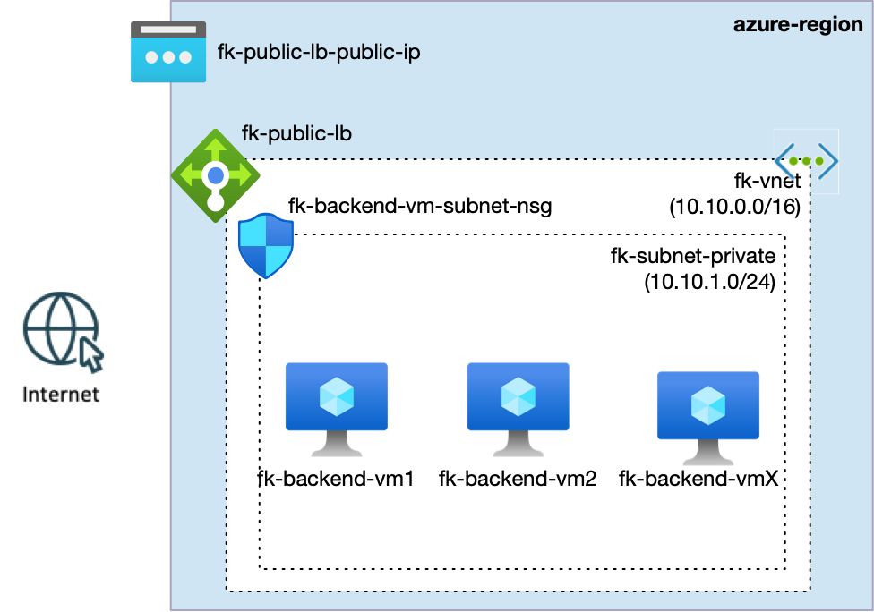
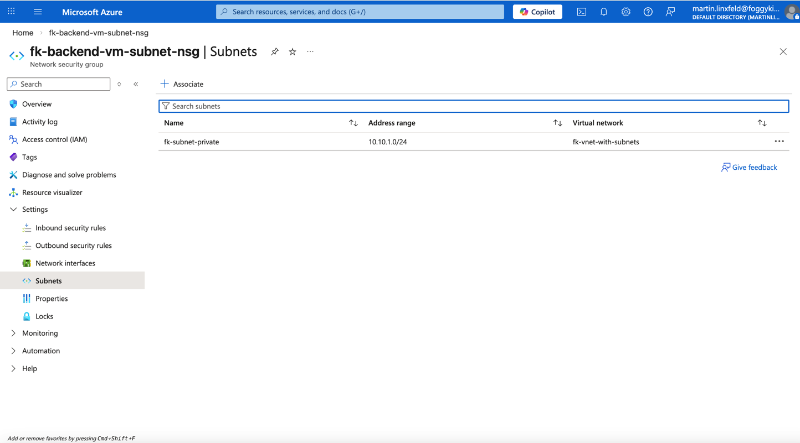

# Example 02: Subnet-level Network Security Group with Load Balancer

In this example, we deploy **multiple private Linux Virtual Machines** behind a **public Azure Load Balancer**,
protected by a **subnet-level Network Security Group (NSG)**.

This example builds directly on Example 01 and demonstrates a different security boundary:
instead of scoping rules to individual workloads (NIC-level NSG),
we enforce a **shared security policy at the subnet boundary**.

------------------------------------------------------------------------

## 🧭 Architecture Overview

This deployment assumes that a Virtual Network already exists
(e.g. created using the `terraform-az-fk-vnet` module).

The Virtual Network contains:
- a **private subnet** for backend workloads,
- an optional **AzureBastionSubnet** (not required for this example),
- a public-facing **Azure Load Balancer**.

All backend virtual machines are deployed into the **same private subnet**.
A single **Network Security Group is associated directly with that subnet**.



*Figure 1. Subnet-level NSG protecting multiple backend VMs behind an Azure Load Balancer.*

This example creates:
- Multiple **private Linux Virtual Machines**
- One **shared private subnet**
- A **subnet-level Network Security Group**
- A **public Azure Load Balancer**
- A backend address pool with health probes
- No public IP addresses on virtual machines
- No NIC-level NSGs

This remains a **foundation example**, now focused on **shared security boundaries and traffic fan-in**.

------------------------------------------------------------------------

## 🎯 Why this example exists

In real Azure platforms:

- workloads are often **homogeneous**,
- security rules are **shared across a tier**,
- applying policies per NIC does not scale operationally.

This example exists to demonstrate:

- the difference between **NIC-level** and **subnet-level** NSGs,
- how a subnet-level NSG automatically applies to **all workloads**,
- how Azure Load Balancer integrates with subnet-scoped security,
- why subnet-level boundaries are common for backend tiers.

This example intentionally avoids:
- public access to individual VMs,
- per-VM security customization,
- Bastion or jumpbox access paths.

------------------------------------------------------------------------

## 🔐 Security Model

- Backend VMs have **no public IP addresses**
- The NSG is attached **directly to the private subnet**
- Inbound HTTP (TCP/80) is allowed **only via the Azure Load Balancer**
- All other inbound traffic is denied by default
- No Network Security Groups are attached to VM NICs



*Figure 2. Network Security Group associated with the private subnet (not with NICs).*

This creates a **shared, tier-level security boundary**.

------------------------------------------------------------------------

## 🚀 Deployment Steps

```bash
tofu init
tofu plan
tofu apply
```

------------------------------------------------------------------------

## 🧪 Test: Load Balancer Connectivity

After deployment, obtain the public IP address of the Load Balancer:

```bash
tofu output lb_public_ip
```

Send HTTP requests to the Load Balancer frontend:

```bash
curl http://<LB_PUBLIC_IP>
```

Expected result:
- HTTP responses are returned successfully,
- traffic is distributed across backend VMs,
- backend VMs remain private and unreachable directly.

------------------------------------------------------------------------

## 🖼️ Azure Portal View

### Subnet-level NSG Association


*Figure 3. NSG applied at subnet scope — all VMs inherit the same rules.*

------------------------------------------------------------------------

## 🧹 Cleanup

```bash
tofu destroy
```

------------------------------------------------------------------------

## 🪪 License

Licensed under the **Universal Permissive License (UPL), Version 1.0**.

---

© 2026 [FoggyKitchen.com](https://foggykitchen.com) - Cloud. Code. Clarity.
